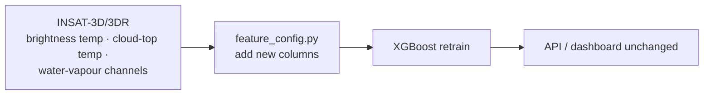

# System Architecture — SIH1521

> To get a PNG/PDF: open https://mermaid.live , paste the block below, and
> export the image. (Free, no account needed.) Alternatively copy into
> https://app.diagrams.net (draw.io) as the skeleton.

```mermaid
flowchart TB
    subgraph DATA["DATA (free, public)"]
        A1[IMD 0.25° daily gridded<br/>rainfall 2001-2020<br/>(target)]
        A2[ERA5 atmosphere via<br/>Open-Meteo archive API<br/>(13 features, daily)]
    end

    B["Preprocessing & merge<br/>src/data/build_dataset.py"]
    C["Feature registry<br/>src/features/feature_config.py"]
    D["Time-aware split<br/>train 2001-16 · val 17-18 · test 19-20"]

    E["XGBoost ensemble (3 seeds)<br/>scale_pos_weight ~48:1"]
    F["SHAP explainer<br/>global + local attributions"]
    G["Reliability module<br/>prob · OOD check · disagreement"]

    H["FastAPI backend<br/>POST /predict · GET /metrics · GET /features"]
    I["Web dashboard<br/>prediction · XAI bars · reliability · perf"]

    A1 --> B
    A2 --> B
    B --> C --> D --> E
    E --> F
    E --> G
    F --> H
    G --> H
    E --> H
    H --> I

    style H fill:#1c2942,stroke:#4aa3ff
    style I fill:#1c2942,stroke:#4aa3ff
    style E fill:#123,stroke:#2fd07a
```

## Future INSAT-3D/3DR branch

